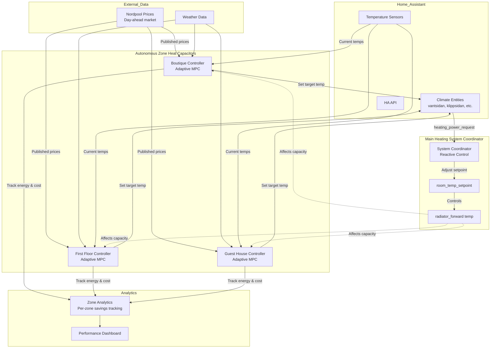
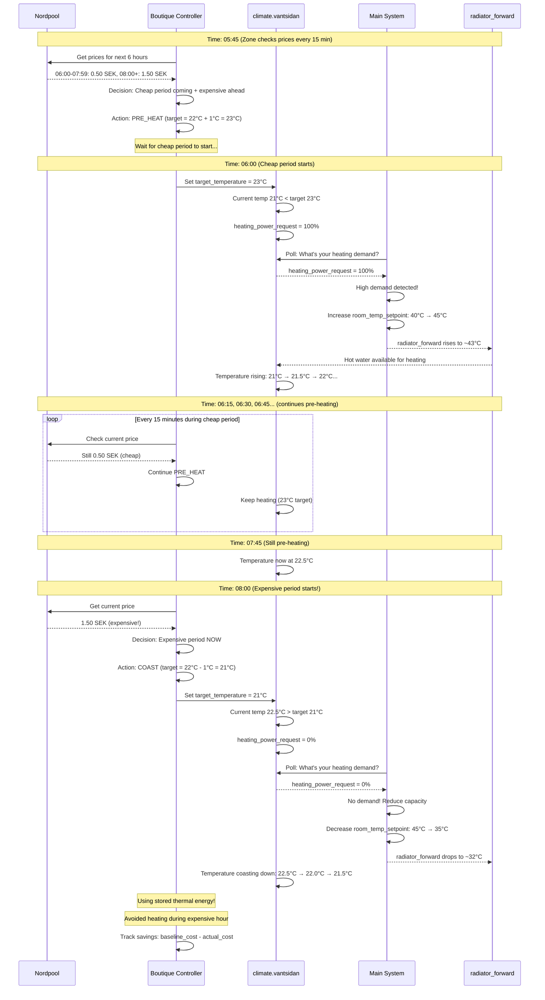

# Theria Architecture

**Document Version:** 3.0
**Last Updated:** 2025-12-23

## Documentation Structure

This document provides the complete architectural specification for Theria, including:

- **Control architecture** - 96-period aggregated scheduling approach
- **System components** - Zone controllers, main coordinator, analytics
- **Technical implementation** - Code examples, algorithms, data flows

For additional documentation, see:

- **[README.md](README.MD)** - Project overview and key features
- **[SYSTEM_SETUP.md](SYSTEM_SETUP.md)** - Reference implementation example

---

## Theria Software Architecture Overview

Theria uses a **hierarchical control architecture** with autonomous zone heat capacitor controllers and an aggregating main system coordinator. Each zone creates a forward-looking 24-hour heating schedule (96 periods at 15-minute resolution) based on electricity prices and its unique thermal characteristics. The main coordinator aggregates all zone schedules to create an optimal main system operation plan, enabling accurate savings prediction and efficient heat pump operation.

### High-Level Architecture



### Control Flow Sequence

This sequence diagram shows how the system responds to electricity price changes:



## Control Architecture: 96-Period Aggregated Scheduling

### Overview

Theria implements a **forward-looking aggregated scheduling** approach where:

1. Each zone creates a **96-period schedule** (24 hours × 4 periods/hour at 15-minute intervals)
2. Zone schedules reflect unique **thermal characteristics** (radiators vs floor heating)
3. Main coordinator **aggregates** all zone demands to create main system schedule
4. This enables **accurate savings prediction** before execution

### 1. Zone Heat Capacitor Controllers

Each zone operates as an autonomous heat capacitor, creating its own 24-hour heating schedule based on electricity prices and learned thermal behavior.

#### Schedule Creation (Daily at ~13:00 when Nordpool prices published)

```python
def create_zone_schedule(zone):
    """Create 96-period heating schedule for a zone."""
    schedule = []

    for period in range(96):  # 00:00, 00:15, 00:30, ..., 23:45
        hour = period // 4
        price = nordpool_prices[hour]

        # Heat capacitor decision logic
        target_temp = calculate_heat_capacitor_target(
            price=price,
            comfort_temp=zone.comfort_target,  # e.g., 21°C
            allowed_deviation=zone.max_deviation,  # e.g., ±1°C
            thermal_model=zone.learned_params  # Unique per zone
        )

        schedule[period] = {
            'target_temp': target_temp,
            'predicted_temp': zone.predict_temperature(period),
            'power_needed': zone.calculate_power_needed(target_temp, period)
        }

    return schedule
```

#### Zone-Specific Thermal Characteristics

**Radiators (Low Thermal Mass):**

- Heat up quickly (minutes to hours)
- Cool down quickly (2-4 hours)
- **Schedule behavior**: Aggressive cycling - short pre-heat periods, frequent adjustments
- Example: Small boutique with radiators (35 sqm, low thermal mass)

**Floor Heating (High Thermal Mass):**

- Heat up slowly (hours)
- Cool down slowly (6-12 hours)
- **Schedule behavior**: Gentle cycling - long pre-heat periods, extended coasting
- Example: Main house with underfloor heating (300 sqm, high thermal mass)

**System automatically adapts** to each zone's thermal behavior through continuous learning.

#### Adaptive Learning (Ongoing)

Each zone continuously improves its thermal model:

```python
# Every 15 minutes (each period execution)
predicted_temp = zone.thermal_model.predict(current_period)
zone.set_target_temperature(schedule[current_period]['target_temp'])

# Wait 15 minutes
actual_temp = zone.measure_temperature()

# Learn from error
prediction_error = actual_temp - predicted_temp
zone.thermal_model.update(prediction_error)
```

**Learned parameters per zone:**

- Thermal mass (C): How much energy needed to change temperature
- Heat loss coefficient (U): How fast zone cools based on outdoor temp
- Heating power capacity: Max heating rate achievable
- Zone weight: Relative power needs (e.g., main house 8× boutique)

### 2. Main System Coordinator (Aggregated Scheduling)

The coordinator aggregates all zone schedules to create an optimal main system operation plan.

#### Aggregation Process (Daily at ~13:05)

```python
def create_aggregate_schedule(all_zones):
    """Aggregate zone schedules into main system schedule."""
    aggregate_schedule = []

    for period in range(96):
        total_heating_demand = 0.0

        for zone in all_zones:
            # Get zone's power need for this period
            target = zone.schedule[period]['target_temp']
            predicted = zone.schedule[period]['predicted_temp']

            if predicted < target:
                # Zone needs heating
                power_needed = zone.calculate_power_needed(target, predicted)

                # Weight by zone size/capacity
                weighted_power = power_needed * zone.power_weight
                total_heating_demand += weighted_power

        # Map aggregate demand to main setpoint
        main_setpoint = demand_to_setpoint(total_heating_demand)

        aggregate_schedule[period] = {
            'total_demand': total_heating_demand,
            'main_setpoint': main_setpoint,
            'timestamp': period_to_timestamp(period)
        }

    return aggregate_schedule
```

#### Zone Weighting (Power Capacity)

Different zones have different power needs based on size and thermal characteristics:

```python
# Example zone weights (learned from system identification)
zone_weights = {
    'main_house': {
        'thermal_mass': 45.6 * 1e6,  # J/K (300 sqm, floor heating)
        'heat_loss': 285.0,  # W/K
        'power_weight': 8.0  # Main house needs 8× more power than boutique
    },
    'boutique': {
        'thermal_mass': 2.33 * 1e6,  # J/K (35 sqm, radiators)
        'heat_loss': 51.7,  # W/K
        'power_weight': 1.0  # Baseline
    },
    'guest_house': {
        'thermal_mass': 8.5 * 1e6,  # J/K (60 sqm, mixed)
        'heat_loss': 95.0,  # W/K
        'power_weight': 2.5
    }
}
```

**Weight calculation:**

- Based on learned thermal mass and heat loss coefficient
- Proportional to zone size and heating capacity requirements
- Automatically calibrated during system identification

#### Demand-to-Setpoint Mapping

```python
def demand_to_setpoint(total_demand_kw):
    """Map aggregate heating demand to main system setpoint."""

    # Learned mapping from historical data
    if total_demand_kw > 12.0:  # High demand
        return 45  # °C - High main setpoint
    elif total_demand_kw > 6.0:  # Medium demand
        return 40  # °C - Medium main setpoint
    elif total_demand_kw > 2.0:  # Low demand
        return 35  # °C - Low main setpoint
    else:  # Minimal/no demand
        return 30  # °C - Standby
```

### 3. Schedule Execution (Every 15 minutes)

#### Zone Controllers

```python
# Each zone follows its pre-computed schedule
current_period = get_current_period()  # 0-95
target_temp = zone.schedule[current_period]['target_temp']
zone.climate_entity.set_temperature(target_temp)
```

#### Main Coordinator

```python
# Follow aggregate schedule
current_period = get_current_period()
main_setpoint = aggregate_schedule[current_period]['main_setpoint']
main_system.set_temperature(main_setpoint)
```

### 4. Savings Prediction & Analytics

Forward-looking schedules enable **accurate savings prediction** before execution.

#### Baseline Calculation

```python
def calculate_baseline_cost(zone):
    """Calculate cost if maintaining constant comfort temp (no optimization)."""
    baseline_cost = 0

    for period in range(96):
        # Energy needed to maintain constant 21°C
        baseline_energy = zone.calculate_baseline_energy(period)

        # Cost at this period's price
        hour = period // 4
        cost = nordpool_prices[hour] * baseline_energy
        baseline_cost += cost

    return baseline_cost
```

#### Optimized Schedule Cost

```python
def calculate_optimized_cost(zone):
    """Calculate predicted cost of heat capacitor schedule."""
    optimized_cost = 0

    for period in range(96):
        # Energy needed for scheduled target temp
        scheduled_energy = zone.calculate_scheduled_energy(period)

        # Cost at this period's price
        hour = period // 4
        cost = nordpool_prices[hour] * scheduled_energy
        optimized_cost += cost

    return optimized_cost
```

#### Per-Zone Savings Tracking

```python
# Calculate predicted savings per zone
for zone in all_zones:
    zone.baseline_cost = calculate_baseline_cost(zone)
    zone.optimized_cost = calculate_optimized_cost(zone)
    zone.predicted_savings = zone.baseline_cost - zone.optimized_cost
    zone.savings_percent = (zone.predicted_savings / zone.baseline_cost) * 100

# Example output:
# Main House: Predicted savings 18% (€3.50/day)
# Boutique: Predicted savings 22% (€0.65/day)
# Guest House: Predicted savings 15% (€1.20/day)
# Total: 17% (€5.35/day)
```

### 5. System Components

**Zone Controller (per zone):**

- Heat capacitor schedule creator
- Adaptive thermal model
- Climate entity interface (set target temps)
- Per-zone analytics tracker

**Main System Coordinator:**

- Schedule aggregator
- Main system setpoint controller
- Demand-to-setpoint mapper
- System-wide analytics

**Analytics Service:**

- Baseline simulation
- Savings calculation (predicted & actual)
- Performance tracking
- Data visualization

**Configuration Service:**

- Zone definitions (comfort ranges, weights)
- Main system parameters
- User preferences

## Key Architectural Principles

- **Decoupling**: Each service operates independently and communicates via defined interfaces/message buses (HA API/MQTT), ensuring that a failure in the UI doesn't stop the heating control, and vice versa.
- **Event-Driven**: The system reacts to events (new price data arrival, temperature sensor update) rather than constant polling, maximizing efficiency.
- **Data Persistence**: All configuration and performance data are stored centrally within the HA ecosystem (HA_DB), leveraging existing backup and data management solutions.
- **API-First Design**: The Configuration API is the only way to interface with the core logic settings, providing a secure and consistent interaction layer.
- **Graceful Degradation**: The system includes multiple fallback modes (full optimization → degraded optimization → PID-only → safe mode) to maintain operation even when components fail.
- **Safety First**: Multiple layers of safety checks prevent dangerous commands, with hard limits on temperature ranges and rate of change.

## Implementation Status

**Current Phase:** Architecture Complete - Ready for Implementation

**Next Steps:**

1. Set up development environment
2. Implement single-zone heat capacitor controller (proof of concept)
3. Add adaptive thermal learning
4. Implement multi-zone aggregated scheduling

## Technology Stack

### Core Technologies

- **Language:** Python 3.11+
- **Numerical Computing:** NumPy, SciPy (for thermal modeling and predictions)
- **Database:** PostgreSQL/SQLite (HA database via InfluxDB for historical data)
- **Framework:** asyncio for async operations
- **API:** FastAPI for REST endpoints

### Integration

- **Home Assistant:** WebSocket API + REST API
- **Communication:** AsyncIO Event Bus (internal), MQTT (optional future)

### Development

- **Testing:** pytest, pytest-asyncio, pytest-cov
- **Type Checking:** mypy
- **Linting:** pylint, black
- **CI/CD:** GitHub Actions

## Service Details

Implementation specifications are covered in the sections above:

- **Zone Heat Capacitor Controllers** - Schedule creation, thermal learning, execution
- **Main System Coordinator** - Aggregation, demand mapping, setpoint control
- **Analytics Service** - Baseline simulation, savings calculation
- **Configuration Service** - Zone definitions, user preferences

Additional implementation details will be developed during prototyping phase.

## Deployment

Theria will be deployed as a Home Assistant Add-on with:

- Docker container packaging
- Automatic dependency management
- Configuration UI integration
- Database migrations
- Health monitoring

Deployment specifications will be developed during implementation phase.

## Development Roadmap

Theria follows a phased implementation approach:

| Phase | Key Deliverable |
| ----- | --------------- |
| 0: Foundation | Single-zone heat capacitor prototype |
| 1: Core Services | Zone controller, HA integration, basic scheduling |
| 2: Thermal Learning | Adaptive thermal model, continuous learning |
| 3: Aggregation | Multi-zone coordination, aggregated scheduling |
| 4: Analytics | Savings prediction, per-zone tracking, visualization |
| 5: Production | Docker packaging, configuration UI, v1.0 release |

Detailed implementation plan will be created when starting development.

## Architecture Review Notes

**Review Date:** 2025-12-23

**Key Design Decisions:**

1. **Forward-Looking Aggregated Scheduling:**
   - 96-period (24h × 15min) schedules created daily
   - Enables accurate savings prediction before execution
   - Allows main system to operate efficiently with pre-planned capacity needs

2. **Heat Capacitor Strategy (PowerSaver-inspired):**
   - Simple buy-sell pair matching based on electricity prices
   - No complex optimization solvers required
   - Runs on constrained hardware (Raspberry Pi compatible)

3. **Zone-Specific Thermal Adaptation:**
   - Automatic differentiation between radiators (low thermal mass) and floor heating (high thermal mass)
   - Each zone learns its unique thermal behavior continuously
   - No manual calibration required

4. **Zone Weighting for Aggregation:**
   - Different zones have different power needs (e.g., 300 sqm main house vs 35 sqm boutique)
   - Weights learned from thermal mass and heat loss coefficients
   - Ensures accurate aggregate demand calculation

5. **Temperature-Based Demand Detection:**
   - No dependency on binary `heating_power_request` sensors
   - Uses predicted vs target temperature differentials
   - Works with any climate entity exposing temperature

**Strengths:**

- Simple, interpretable control logic
- Accurate forward-looking savings prediction
- Handles heterogeneous zones (different sizes, thermal characteristics)
- No external optimization solvers needed
- Scales to any number of zones

**Implementation Recommendations:**

1. Start with single-zone heat capacitor to validate approach
2. Add adaptive thermal learning before multi-zone coordination
3. Implement aggregation with simple zone weighting
4. Build analytics and savings tracking in parallel
5. Test with real price data and measured thermal responses
